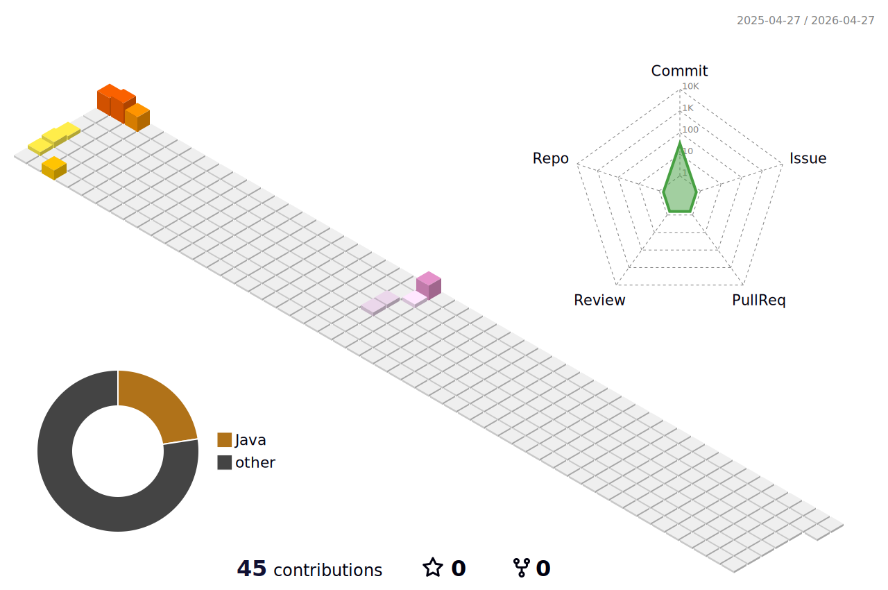

<h1 align="center">Hi 👋, I'm Arif</h1>
<h3 align="center">A passionate data engineer from USA</h3>

  

- 💬 Ask me about **Data engineering, Big data, Business Intelligence**

- 📫 How to reach me **rahman.mdarif32@gmail.com**

- 👨‍💻 Check out my portfolio website [www.mdarifrahman.com](https://www.mdarifrahman.com)

<h3 align="left">Connect with me:</h3>

### Tech Stack

### Tools & Achievements

🔹 Built scalable **ETL Pipelines** processing **1 TB/day**  
🔹 Expert in **Data Modeling** and **Visualization**  
🔹 Designed **Power BI** dashboards with **DAX**  

# 

&nbsp;

<!--
**arahman6/arahman6** is a ✨ _special_ ✨ repository because its `README.md` (this file) appears on your GitHub profile.

Here are some ideas to get you started:

- 🔭 I’m currently working on ...
- 🌱 I’m currently learning ...
- 👯 I’m looking to collaborate on ...
- 🤔 I’m looking for help with ...
- 💬 Ask me about ...
- 📫 How to reach me: ...
- 😄 Pronouns: ...
- ⚡ Fun fact: ...
-->

-----------

